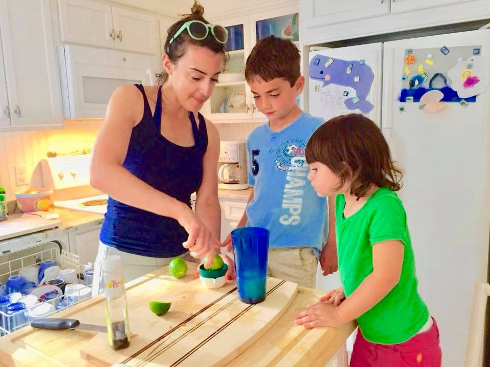

```{r setup, include=FALSE}
knitr::opts_chunk$set(echo = FALSE)
```

---

<a href="https://twitter.com/PavlovSociety?ref_src=twsrc%5Etfw" class="twitter-follow-button" data-show-count="false">Follow @PavlovSociety</a><script async src="https://platform.twitter.com/widgets.js" charset="utf-8"></script>

---

#July, 2020: Dr. Caitlin Orsini


Dr. Orsini, an Assistant Professor of Psychology at The University of Texas at Austin, earned her PhD at the University of Michigan and completed her postdoctoral work at the University of Florida. In her lab at The University of Texas at Austin, Dr. Orsini and her trainees study the neural mechanisms of maladpative decision making underlying neuropsychiatric diseases, including substance abuse disorders and post-traumatic stress disorder, as well as the influence of gonadal hormones on these processes.

<a href="https://twitter.com/CaitAnne?ref_src=twsrc%5Etfw" class="twitter-follow-button" data-show-count="false">Follow @CaitAnne</a><script async src="https://platform.twitter.com/widgets.js" charset="utf-8"></script>

---

###__What project are you currently most excited about in your lab?__

Although I am passionate about all of the ongoing projects in the lab, I am really excited about our work focusing on identifying the neurobiology underlying hormonal regulation of decision making. I think the findings from these experiments may hold significant promise for developing strategies to rescue cognitive impairments that contribute to the persistent nature of substance use disorders. Stay tuned.
 
###__What is the best part about being a PI?__

I think the best part about being a PI is also the most challenging. I now have the freedom and latitude to develop a research program and a research team focused on scientific issues that I care deeply about. This is not to say I did not care about the work I did as a PhD student and a postdoctoral fellow; in those positions, however, my focus was guided and influenced by my supervisors. As a PI, I am now the one who dictates the direction of the lab and who now influences the trainees in my own lab. With this creative freedom and independence also comes an immense amount of responsibility, for the continued productivity of the lab and for my trainees. Although this is a challenging part of the job, I still wake up every day excited by the possibility of scientific discovery and the knowledge that I can contribute to its pursuit.

###__If you weren’t a scientist, what would you be?__

I would undoubtedly be a veterinarian. 
 
###__What is the best concert you’ve ever been to?__

Most recently, Mumford & Sons. The Chicks are a close second, but that concert was many years ago (yet still memorable). 
 
###__What’s your go-to dessert?__

Chocolate chip banana cake with chocolate cream cheese icing (happy to share the recipe).
 
###__What is the best vacation you’ve ever been on?__

The best vacation was a trip to Napa Valley with my husband for our five-year wedding anniversary. 

###__What’s been most rewarding about starting a new lab?__

One of the most rewarding aspects of starting a new lab is to see my vision of the lab become reality. As an incessant planner, I had designed and planned the layout and structure of the lab long before I arrived at UT. The process of acting upon those plans and building the lab was more gratifying than I had anticipated. The final product is one that I am immensely proud of. Equally rewarding, however, was accepting my first PhD student and mentoring her as we both began these new chapters of our lives. As a new PI, I have the time and ability to work closely with my trainees and I therefore see firsthand how they develop as scientists. The reason I pursued a career in academia was borne out of my desire to have the same impact my mentors had on me. I now have that opportunity and it is one of the most fulfilling parts of my job.

###__What do you wish you knew when you were a trainee about running a lab?__

The amount of time spent responding to emails. When I first started my lab, I could not believe how much time I spent on emails. Because I felt distracted and interrupted when I kept my email open during the day, I have since self-imposed an email policy where I only check it in the morning and in the afternoon, spending 30 minutes each time managing emails before closing it again and returning to what I had been doing.
 
###__What do you love about the Pavlovian Society?__

There are so many things to love about the Pavlovian Society, but I will highlight two. First, the scientific community is supportive and caring, creating the feeling of a large family rather than a professional organization. The second thing that I most appreciate about the Pavlovian Society is the almost singular focus on understanding behavior. We are often distracted by new techniques and methods to examine the neurobiological basis of behavior, but to be able to use those tools effectively, we still need to understand the complexity of the behavior itself. Ultimately, don’t we all want to know why we do what we do? The Pavlovian Society epitomizes this sentiment (although not at the expense of innovative neuroscience) and, for this reason, it will always remain one of my favorite scientific communities.


---

#June, 2020: Dr. Maria Diehl


Dr. Diehl earned her doctorate at the University of Rochester School of Medicine and completed postdoctoral work at the University of Puerto Rico School of Medicine. [In her lab](https://www.diehllab.com/home) at Kansas State University, Dr. Diehl and her students examine the neural substrates that underlie active avoidance learning using single-unit electrophysiology and optogenetics, as well as how social cues influence this type of avoidance. 

<a href="https://twitter.com/DrDiehl_neuro?ref_src=twsrc%5Etfw" class="twitter-follow-button" data-show-count="false">Follow @DrDiehl_neuro</a><script async src="https://platform.twitter.com/widgets.js" charset="utf-8"></script>

---

###__What project are you currently most excited about in your lab?__

I’m developing a new task to look at how social cues can influence active avoidance. Using the platform-mediated avoidance task, I’m going to train rats to learn avoidance with a social partner. Their partner will have different experiences related to fear/avoidance, and I want to know how the learned experiences of the partner affect the other rats’ learning of avoidance. We would hypothesize that a partner already familiar with avoidance would cause the other rat to learn avoidance quickly through observational learning. But would a fearful partner have the same effect or might it impair avoidance learning of the other rat? I’m using this paradigm to understand how individuals develop resiliency through social cues/interactions.


###__What is the best part about being a PI?__

Definitely being able to set my own schedule and being my own boss. It is so fun for me to come up with interesting scientific questions about the brain and behavior and be able to design the experiments and find the answers. 

###__If you weren’t a scientist, what would you be?__

I think if I were not a scientist, I would want to start a dog rescue organization. It is so sad to see abandoned, mistreated, and lonely dogs! My dog Sinfo (pronounced SEEN-foe) is a rescue from Puerto Rico, and I love him so much. I would love to be able to give a loving home to a stray dog and also give a lonely, loving dog to a person who needs the companionship!

###__Are you a dog person or a cat person?__

Dog person! I’m sure you could tell from my answer above. Cats are cool too, especially if they act like dogs.

###__What is the best vacation you’ve ever been on?__

I love adventure, and one of the most adventurous vacations I’ve been on was a trip I took with my husband to Guatemala to visit his brother who was working at an orphanage there. We explored Guatemala City and Antigua and also took a road trip to Copan Ruinas, Honduras during Easter. We saw some beautiful sites and met some very kind, amazing people.

###__What’s been most challenging about starting a new lab?__

Making so many big decisions. As a trainee, you often rely on your PI/mentor that they will know what to do, but when you have your own lab, it’s all on you. There’s a lot to figure out that you weren’t exactly taught as a trainee, especially managing people and money. It’s good to find a community or support system who can give you advice on how to navigate being a New PI. Also, you have to organize your time and schedule really well, otherwise you’ll end up forgetting about meetings and deadlines really fast!

###__What’s been most rewarding about starting a new lab?__

I love working with students and getting them excited about neuroscience. It’s awesome watching them become independent thinkers and come up with cool ideas for our research.

###__What do you love about the Pavlovian Society?__

I love the sense of community. It really seems like people lift each other up and support one another in a positive way. I’m excited to become more involved as New PI!


---

#May, 2020: Dr. Debra Bangasser


Dr. Debra Bangasser is an Associate Professor of Psychology and Director of the program in Neuroscience: Systems, Behavior, and Plasticity at Temple University. She earned her PhD with Dr. Tracey Shors at Rutgers University and conducted postdoctoral training with Dr. Rita Valentino at The Children’s Hospital of Philadelphia. [In her lab at Temple](https://sites.temple.edu/bangasserlab/), Dr. Bangasser and her lab members study how stress interacts with biological sex to produce robust sex differences in psychiatric disease.

<a href="https://twitter.com/Bangasser_Lab?ref_src=twsrc%5Etfw" class="twitter-follow-button" data-show-count="false">Follow @Bangasser_Lab</a><script async src="https://platform.twitter.com/widgets.js" charset="utf-8"></script>

---

###__What project are you currently most excited about in your lab?__

I have been studying sex differences in the stress neuropeptide, corticotropin releasing factor (CRF), for years. My early work found that the locus coeruleus-arousal system of female rats was more sensitive to CRF than that of male rats due to sex differences in the CRF1 receptor. Recently, my lab as been looking at other regions that are a target of CRF regulation with a focus on cholinergic areas. My former grad student, Kim Wiersielis, found that CRF in the medial septum (a major source of acetylcholine for the hippocampus) impairs spatial learning in male and female rats. However, males are more sensitive, responding to a low dose of CRF in the medial septum that does not affect females. Females may be protected from low levels of CRF in the medial septum, because in this region they have more CRF binding protein, an endogenous protein that sequesters CRF preventing its bioavailability. My lab was recently funded by the NSF to follow up on this project and determine what causes these sex differences, discover more about CRF binding protein (e.g., what septal cells produce it, etc.), and link CRF in the medial septum to hippocampal changes in acetylcholine release.  What I find fascinating about CRF is that there are sex differences in sensitivity to this important stress neuropeptide, but they are region specific. Of course, stress affects both sexes. However, sex differences in CRF sensitivity can drive different responses to stress that may, in some cases, lead to different stress vulnerabilities in males vs. females. Psychiatric disorders are exacerbated by stress, and epidemiological data reveal that women are more likely to suffer from disorders with hyperarousal features, such as PTSD, and men are more likely to suffer from disorders with cognitive deficits, such as schizophrenia. It is possible that sex differences in stress responses contribute to some of the sex differences in psychiatric disorders. 

###__If you weren’t a scientist, what would you be?__

I’ve always loved scuba diving, so my back up plan is to own a dive shop on a tropical island.

###__What is the best part about being a PI?__

I have two favorite parts: discovery and mentoring. It is so exciting to get new data, especially if it is unexpected and challenges my preconceived notions about how something would turn out. I also enjoy training and mentoring students. We have a lot of undergrads in the lab, who understandably have no experience. It’s great to see them go from learning lab basics to contributing intellectually to projects. Mentoring grad students is also rewarding. I’m always impressed with how quickly they gain expertise and begin to drive their science. I’m so lucky to have a job where I can help facilitate this growth. 

###__What is your favorite bird?__

Tree swallows. They return to southeastern Pennsylvania in mid-March when I’m so sick of winter. Not only are they beautiful, but they give me hope that spring will arrive. 


###__What is your go-to karaoke song?__

I’m a terrible singer, so my song choices are ones where I can distract from my singing with my performance. I have three: Jolene, Sweet Child of Mine, and Home Sweet Home. 

###__What is the best vacation you’ve ever been on?__

I’ve been lucky to travel to many amazing places, but when pressed, Raja Ampat, Indonesia. It has the best coral reef I have ever seen, and, in fact, it is the world’s most biodiverse marine region. Also, I saw and photographed two birds-of-paradise species (Not the flower, the actual birds. Think David Attenborough). 

###__What’s the best show you’ve ever seen?__

Hamilton. It was amazing!!! I already loved the songs but seeing it with the dancing was even better! _[Editor's note: Firm agree.]_

###__What do you love about the Pavlovian Society?__

The Pavlovian Society meeting was the first meeting I went to. I just started grad school when Tracey Shors (my grad mentor) was president. What I didn’t appreciate until I went to SfN, was how Pavlovian Society was great for networking. It was a meeting where, as a trainee, I could meet and chat with leaders in the field. It was also good for meeting other trainees, and in fact, I’m still friends with many of the trainees I met in the olden days.  

 claims is the world's most dangerous bird._](./photos/Debbie2.jpg)

---

#April, 2020: Dr. Michael Saddoris


Dr. Saddoris is an Assistant Professor of Behavioral Neuroscience at the University of Colorado Boulder. Dr. Saddoris earned his PhD with Drs. Michela Gallagher and Peter Holland at Johns Hopkins University and completed his postdoctoral work with Dr. Regina Carelli at the University of North Carolina. [In his lab](https://www.saddorislab.org), Dr. Saddoris and his team study the neural mechanisms that underlie decision making in situations that involve risk-reward conflicts, as well as how both the brain and behavior change following exposure to drugs of abuse. 

<a href="https://twitter.com/msaddor1?ref_src=twsrc%5Etfw" class="twitter-follow-button" data-show-count="false">Follow @msaddor1</a><script async src="https://platform.twitter.com/widgets.js" charset="utf-8"></script>

---

###__What project are you currently most excited about in your lab?__

We are really excited about some data that has been piling up looking into how animals resolve risk-reward conflicts. One of the most fun parts of this has been to come up with ways to solve some of the confounds in the design of decision making tasks that sometimes we feel we have to use in order to get the rats to give us reliable data. But, not surprisingly, the rats are highly adaptive and creative in solving more continuously-updating tasks and using that information appropriately – just like they would in a more naturalistic setting. With that perspective, we’ve been using these newer models of decision making where our subjects can “wager” bets as they choose and we can model neural activity in these processes to see how the brain encodes this kind of information, and of course what happens when they win or lose.

Beyond the specific experiments in my lab, though, I’ve been encouraged to see the field moving in a direction that is embracing the fuller range of animal behavior in the last few years. For as long as I’ve been a researcher, the emphasis (including my own!) has often been on designing tasks that fit the researchers’ needs such as discrete stimuli and reliable repeatable effects, whether or not those effects are actually any good at modeling anything with translatable value. But recently, there’s been a growing appreciation of all the complexity we need to think about when translating our animal models into human public health situations. For example, in the drug addiction world, there’s been a reckoning about what – if anything – our self-administration models are actually modeling. The renewed focus on the variety of access schedules, concurrent access with competing outcomes, persistent drug taking in the face of aversive consequences – all of these are giving the field some real renewed enthusiasm in trying to understand how we think about addiction and the brain, and thus how we think about the value of our research models. I think that a time in which we have unprecedented access to the most sophisticated molecular tools, there’s this parallel drive to really think about the importance and validity of our behavioral approaches. In the end, sophisticated tools don’t amount to much translational value to human health if we aren’t getting the basic behavioral models correct. So all of that renewed appreciation of behavioral approaches, including a range of great work from researchers and support from NIH itself, is also driving my excitement in the lab right now. 

###__What is the best part about being a PI?__

I guess it’d have to be the sort of active ferment of ideas being driven by all the minds in the group. As I’ve gotten more experience running a lab, “letting go” has been part of my mentoring strategy, because honestly, the individual talents and passions of each of my amazing trainees has been something you can’t really plan for other than in a very general stochastic sense. Everyone brings with them these unique set of experiences, both from their previous labs and from the world generally, that guides what lights a spark in them and gets them exciting about being in the lab. Over time, I’ve been better able to learn how to create spaces for the trainees to push their ideas and to fold those into the ongoing lab goals in a more organic way than I was able to do when I was just starting my lab. As such, we have really amazing projects going on that have been driven by ideas from postdocs, grad students, and even some exceptionally talented undergrads that weren’t even on my radar as of a couple years ago. Running the lab you have a better appreciation of how there’s a satisfying way all the organic messy pieces often click together. That ability to take a moment and look back at that path, and really appreciate the collaborative aspect of the whole process with such a passionate group of people has been really rewarding. 

###__If you weren’t a scientist, what would you be?__

As a junior faculty, you kind of always have this in the back of your mind, I suppose. I don’t have a huge backlog of repressed talents to fall back on, but being in this job for a while now, I’ve come to really appreciate how much value comes from the totality of our jobs as scientists. Mostly what I discover is that you could theoretically fill your days with non-research-related activities that could have a huge impact on people’s lives in an immediate way, and sometimes it’s hard to step away from that because you know you absolutely do not have the time and resources to keep that going. Maybe if I couldn’t be a scientist, those would be a great way to move these projects forward.  

###__What do you have for your birthday dinner?__

I really like to cook, so I usually try to come up with some multi-day marathon kind of thing where there are steps involving yeasts, smoke, and getting up before sunrise. The challenge is pretty much the point. 

###__If you could go anywhere in the world and do anything for one day, where would you go and what would you do?__

I suppose my answer would be bikepacking though bike-friendly parts of the world, and eating liberally of local foods along the way. I’ve never biked through Europe, but I watch a lot of cycling and like to imagine what it’d be like to trace the routes of the Classics. On a typical day here, unless there’s ice on the ground, you can usually find me on my bike year round, and I find that it’s the best way to see the world in general. Living in Boulder, there are a lot of cyclists here, but they all seem to enjoy pointing themselves straight uphill and summiting mountains. And you know, hats off to them. But as a native Iowan, my tastes are still firmly trend towards the long rolling hills variety, hitting towns every 20mi or so to stop for some local delicacy.

###__What advice would you give yourself as a trainee?__

In a very literal sense: Take a damn programming class and master that skill. So many attempts to just sit down and master programming ends up getting pushed to tomorrow; it feels like there’s always something more pressing. Trainee-me should give PI-me a swift kick in the shins every time he sees me even opening Excel.

###__What do you love about the Pavlovian Society?__

I was raised by behavior-driven mentors, and they really drilled into me how to approach critical problems in neuroscience through a behavior lens. Animals evolved to solve problems in their environment, and so it follows that if you want to know how the brain works, it’s essential to know what it’s for and how it’s used. The fashionability of behavior ebbs and flows in the behavioral neuroscience, but through it all, Pavlovian Society provide a home for people who work on these problems in earnest and make progress on these important issues. The community has been really great in this regard, providing connections across labs and training opportunities for younger scientists to developing this thinking and skills. I mean, between profiles like this and Jeff’s regular updating on Society jobs and news, it’s really a special community, and proud to be part of it!


---

#March, 2020: Dr. Donna Calu


Dr. Donna Calu is an Assistant Professor in the Department of Anatomy and Neurobiology at the University of Maryland School of Medicine in Baltimore, Maryland. She conducted her graduate work at the University of Maryland School of Medicine and postdoctoral work at the National Institute of Drug Abuse. [In her lab](https://www.calulab.com), Dr. Calu and her students study the neural mechanisms that underlie individual differences in vulnerability to drug addiction as well as how these brain systems are changed by voluntary drug-taking behavior. Dr. Calu was recently awarded the highly-prestigious Presidential Early Career Award for Scientists and Engineers (PECASE).

<a href="https://twitter.com/CaluLab_Bmore?ref_src=twsrc%5Etfw" class="twitter-follow-button" data-show-count="false">Follow @CaluLab_Bmore</a><script async src="https://platform.twitter.com/widgets.js" charset="utf-8"></script>

---

###__What project are you currently most excited about in your lab?__

Recently we’ve had several surprising outcomes from our mainstream projects examining the amygdala circuits mediating individual differences in Pavlovian devaluation sensitivity, which continue to be very exciting for me. Several students and postdocs have developed projects taking us in new directions including probing the role of VTA endocannabinoids in gating DA differences in sign- and goal-trackers, the role of BNST in driving incubation of fentanyl craving, and using behavioral economic approaches to investigate how 5HT2A agonists shift demand for opioid drugs of abuse. 

###__Looking back at your career so far, what are you most proud of?__

Feeling simultaneously proud of the mentoring/training environments I came from and the one I have managed to create. This realization came recently after I experienced a sudden personal loss that kept me away from the lab for several months. While I was away, I had falsely anticipated that my absence would have a substantial negative impact on lab productivity, culture and experimental outcomes. Upon my return, I was humbled and relieved to find out how wrong I was. First, the data. The incredible data that came out of that time in the lab was inspiring. It was clear that trainees leaned on one another in order to navigate the day to day challenges of running their studies. Second, the strengthened bonds between team members were evidence that we all made it through something big, and we would all be stronger for it. I am forever grateful for my science family, past and present, that supported us through the challenging time. Finally, I was super proud of how each trainee demonstrated deeper and more independent thinking about their projects. This has taken our work in new directions and showed me that I could, and should, let go of the intellectual micromanagement. Though admittedly I see how this is creeping back and it’s important to keep it in check, so thanks for asking! 

###__If you weren’t a scientist, what would you be?__

I don’t know why a whale-watching boat captain comes to mind, but it does. Is that too far out? _[Editor's note: It is not too far out!]_ I have never been whale watching so that’s probably something I should try first. And captaining a small vessel is probably a pre-req, I should maybe get on that. Once the skillsets are acquired I think it would be a good mix of challenging, peaceful and awe-inspiring. 

###__What’s your favorite pie?__

Does chicken pot pie count? _[Editor's note: It definitely does count!]_ If not, I will politely accept a slice of any traditionally sweet pie, ideally served with a 2:1 ice cream to pie ratio. Yes, whipped cream too please. 

###__What is your ideal Saturday out of the lab?__

Short answer: spending time with my awesome family. Longer answer: Starting the day with peaceful coffee consumption, followed by kids enjoying themselves (eating continuously enough to maintain adequate blood sugar levels) while husband and I watch or partake in fun activity with them. Depending on time of year these activities may include biking and kite flying, playing/gardening in the yard, fishing and chilling at the bayside park, kid sports/sideline chill, extended family time, camping and seeing bluegrass inspired music, baking, board games and PG movies, skiing/snowboarding on occasion.

###__What’s the best book you’ve ever read?__

Tom Robbins’ Skinny Legs and All. Painted stick and Spoon are two of my favorite characters of all time, and this was my intro to Tom Robbins, who I anticipate will always be my favorite author. 

###__What advice would you give yourself as a trainee?__

Leave what you perceive as the expectations of others at the door. The lab/office door and your own front door. Schedule time to write. Schedule time to disconnect from work. You have a ticket to get into the park, but you don’t have to ride the roller coaster. The ups and downs of life in science are an inevitable part of the process. Cherish the victories large and small, and completely separate emotion from experimental failure, criticism and professional rejection. These are more like daily mantras than advice I’d give myself as a trainee, but hey, it’s an ongoing process. 

###__What do you love about the Pavlovian Society?__

I appreciate that the Pavlovian Society is made up of so many like-minded people that care about the subtlety and sensitivity of behavior. I love that behavior takes center stage, with neuroscience integrated, and behavior constantly revisited. I am honored to be featured here and motivated to become more involved. 


---

#February, 2020: Dr. David Knight


Dr. David Knight is a Professor of Psychology at the University of Alabama at Birmingham. He conducted his doctoral work with Dr. Fred Helmstetter at the University of Wisconsin-Milwaukee and postdoctoral work at the National Institute of Mental Health with Dr. Peter Bandettini. In his lab at UAB, Dr. Knight and his students use fMRI to investigate the neural substrate of human learning, memory, and emotion. They are especially interesting in studying the neural processes that contribute to mood and anxiety disorders.

###__What project are you currently most excited about in your lab?__

We have a new study focused on Posttraumatic Stress Disorder (PTSD) and fear conditioning. We are specifically interested in the impact that being able to predict and control a threat (i.e. an aversive unconditioned stimulus; UCS) has on behavior and the neural function that supports learning. Nate Harnett’s work from the lab has previously demonstrated that trauma-exposed participants show fear learning deficits. Kimberly Wood’s work in the lab has shown that the hippocampal and ventromedial prefrontal cortex activity of healthy volunteers varies with the predictability and controllability of the UCS. Our current study, led by Heather Dark and Juliann Purcell, will determine whether the ability to predict and control the UCS alters fear learning in unique ways for those with PTSD compared to those without PTSD and will shed new light on the neural function that underlies these learning-related processes.

###__If you could give one piece of advice to yourself as a trainee, what would it be?__

Schedule protected time for writing every week. If I don’t schedule time to write, it becomes very easy to put the writing off, week after week, as I focus on other activities (e.g., collecting/analyzing data and administrative responsibilities). I’ve become much more efficient and productive (and less stressed) since I’ve started scheduling protected time to work on papers and grants.

###__What was your first research experience?__

I earned my undergraduate degree in Psychology at Truman State University, where I joined Fred Shaffer’s psychophysiology and biofeedback lab. We completed a number of studies investigating the impact cognitive and behavioral functions have on diaphragmatic breathing and psychophysiological responses. 

###__What triggered your interest in studying learning and memory?__

My interest in learning and memory was triggered by my sister, who is 10 years older, on her trips home from college. She was learning about behaviorism in a psychology class and shared what she learned on her visits home. She even put me on a reinforcement schedule to modify some of my less appealing habits, which I will begrudgingly admit worked. That was my introduction to psychology and was the beginning of my interest in learning and memory.

###__What are your favorite non-science related activities?__

Spending time with my daughter. She is 17 years old, super smart, and lots of fun to hang out with. I also like taking weekend naps…then texting friends to brag about how nice my naps were. Finally, I have been running regularly for the past few years. I’m trying to add years to my life and get into better shape to enjoy those years. I’m running my first half marathon in February! After that, I’ll think about training for a full marathon.

###__What is your favorite part of running a lab?__

Mentoring trainees is my favorite part of running a lab. The most rewarding part of my job is helping students work through the challenges they encounter, whether they are related to the lab, classroom, or another part of their life.

###__What is your proudest professional achievement?__

I would say that getting my first “real” job at UAB (University of Alabama at Birmingham) was the professional achievement of which I am most proud. Getting a faculty position was the culmination of all the other accomplishments along the way. Each of my other achievements (e.g., completing college, graduate school, and postdoc) were really just intermediate steps along the path to getting a faculty position.


---

Questions for December compiled by Eliza Greiner

<a href="https://twitter.com/ElizaMackenzieG?ref_src=twsrc%5Etfw" class="twitter-follow-button" data-show-count="false">Follow @ElizaMackenzieG</a><script async src="https://platform.twitter.com/widgets.js" charset="utf-8"></script>

---

#January, 2020: Holiday Break


---

#December, 2019: Dr. Janine Kwapis


Dr. Janine Kwapis is an Assistant Professor of Biology at Pennsylvania State University. She earned her PhD at the University of Wisconsin-Milwaukee and conducted her postdoctoral training at the University of California, Irvine. In her lab at Penn State, Dr. Kwapis and her students study the molecular and epigenetic mechanisms that support long-term memory formation, storage, and updating and how these processes change across the lifespan.

<a href="https://twitter.com/J9Kwapis?ref_src=twsrc%5Etfw" class="twitter-follow-button" data-show-count="false">Follow @J9Kwapis</a><script async src="https://platform.twitter.com/widgets.js" charset="utf-8"></script>

---

###__What project are you currently most excited about in your lab?__

There are two projects that I’m super excited about right now. First, we are trying to understand the functional role of circadian genes in modulating memory formation across the day/night cycle. We have found that at least one circadian gene, Period1 (Per1) plays an important role in memory formation and our most recent data suggest that Per1 may function differently during the day versus at night, changing the likelihood of memory formation. We’re also investigating how memories are modified in response to new information. As a side project in my postdoc lab, I developed a task (called OUL – Objects in Updated Locations) that can assess both an original memory and updated information in a single test session. We’re using OUL now to figure out how memory updating is different from initial memory formation.

###__If you could give one piece of advice to yourself as a trainee, what would it be?__

Learn when to cut off a project or technique that’s not working and switch to something else. It took me a while to realize that an important part of science is learning when to cut your losses and instead try a different approach or ask a new question. It’s something you learn with time, but sometimes when things aren’t working, it makes you concentrate on what is working and that’s often where you find the interesting, unexpected discoveries!

###__What is/are your favorite non-science related activities?__
I love to read, play volleyball (even though it has been a while!), and spend time with my family.

###__How do you create a healthy work/life balance for yourself and your lab members?__

Building the right lab environment has been super important to me since we opened our doors in January. I was fortunate to start my lab with a really fantastic technician (Kasuni Bodinayake – keep an eye on her -- she’s applying to PhD programs right now!) who has been instrumental in setting a positive tone for our new lab. Everyone in lab works really hard and I’m proud of the good, solid science we’re doing, but I’m also proud to see that everyone is thriving outside of lab, too. 

###__What advice would you give to a graduate student in the field of learning and memory who is looking to become an independent investigator in the future?__

Work on your communication skills, both speaking and writing. As an incoming graduate student I had no idea how much of this job involves writing and speaking. Being able to communicate your science is fundamental and can be the difference in whether you get a job offer or get a grant. These are things that you learn with time, so practice early and often.

###__What do you love about the Pavlovian Society?__

I love that everyone in the Pavlovian Society appreciates how important and nuanced behavior is. It’s also a really great group of people and I love getting to see some of my oldest friends at the yearly meeting. I’m also really proud of [Women in Learning (WIL)](https://www.womeninlearning.com) and the work we’re doing.


---

Questions for December compiled by Hayley Fisher

<a href="https://twitter.com/hayfish24?ref_src=twsrc%5Etfw" class="twitter-follow-button" data-show-count="false">Follow @hayfish24</a><script async src="https://platform.twitter.com/widgets.js" charset="utf-8"></script>

---

#November, 2019: Dr. Nadia Chaudhri


Dr. Nadia Chaudhri is an Associate Professor of Psychology at Concordia University and Director of the Center for Studies in Behavioral Neurobiology. She completed her PhD at the University of Pittsburgh and conducted her postdoctoral training at the University of California, San Francisco. In her lab, Dr. Chaudhri and her trainees study the neurobiological mechanisms of addictive behaviors using appetitive conditioning paradigms (both Pavlovian and instrumental) and neuroscientific techniques like neuropharmacology, in-vivo optogenetics, chemogenetics, in-vitro electrophysiology, and immunohistochemistry. They are especially interested in how cues become paired with reinforcing stimuli in a way that promotes relapse following extinction.

<a href="https://twitter.com/DrNadiaChaudhri?ref_src=twsrc%5Etfw" class="twitter-follow-button" data-show-count="false">Follow @DrNadiaChaudhri</a><script async src="https://platform.twitter.com/widgets.js" charset="utf-8"></script>

---

###__What project are you currently most excited about in your lab?__

It’s impossible to pick a favourite, so I’ll tell you about 2. My graduate students (Alexa Brown and Franz Villaruel) are studying brain regions involved in appetitive extinction. Experiments in this project that branched away from standard extinction paradigms have produced exciting results. Another graduate student (Mandy LeCocq) adapted the reinstatement paradigm for use with alcohol, and her project is generating heaps of interesting data. 

###__What triggered your passion for studying learning and memory?__

I’ve always loved biology, and have a clear memory from high school of the first time I saw cell division through a microscope. I wasn’t introduced to the brain or Psychology until college, and my fascination with biology transmuted into a desire to understand the neural basis of behaviour, particularly maladaptive behaviour like excessive drug use. I draw on the rigorous behavioural designs in learning and memory research to inform my work on extinction learning and substance use disorders. 

###__If you could research something completely different, what would it be?__

I’d study plant biology. I’m crazy about plants, fungi and growing my own food.  

###__What are you most excited about in the learning and memory field?__

My background and training is in addiction research, so I’m a relative newcomer to the learning and memory field. It’s exciting to see modern neuroscience approaches being applied to theoretically-driven learning and memory studies. Recent work on sex- and individual-differences is also keeping learning and memory research at the cutting edge. 

###__What is/are your favorite non-science related activities?__

I’ve been doing yoga for a few years, and I recently started a ‘Strong-by-Zumba’ class that I love. It’s like 1980’s aerobics, but edgier and without leotards. I also love feeding people and often throw spontaneous dinner parties. 

###__What are you most proud of in your career?__

I grew up in a low-income family in Pakistan and now I’m an Associate Professor of Psychology at a Canadian university. Describing this journey is ‘beyond the scope of this article,’ but I’m incredibly proud just to be where I am right now. I love being a scientist, creating opportunity for my lab members, and being in a position where I can advocate for the next generation of scientists. 

###__Who influenced you the most throughout your career?__

As a graduate student I was co-supervised by Alan Sved and Anthony Caggiula at the University of Pittsburgh. Alan is whip-smart and sharp as a tack, and Tony is a creative genius. Reconciling the very different feedback that they both gave me on papers did wonders for my scientific writing. I also had an amazing postdoctoral supervisor, Patricia Janak. Tricia gave me independence, resources, and sponsorship, all of which set the stage for me to flourish. Tricia is an incredibly successful, brilliant researcher, and a role model for me and many other scientists.

###__What do you love about the Pavlovian Society?__

Everything! The rigorous science, the people, the WIL lunch, drinks at the hotel bar. It’s a fantastic, focused meeting that feels welcoming and supportive of junior scientists. 


---

Questions for November compiled by Alex Chisholm

<a href="https://twitter.com/iamalexchisholm?ref_src=twsrc%5Etfw" class="twitter-follow-button" data-show-count="false">Follow @iamalexchisholm</a><script async src="https://platform.twitter.com/widgets.js" charset="utf-8"></script>

---

#October, 2019: Dr. Catharine Rankin


Dr. Catharine Rankin is a professor in the Department of Psychology and a member of the Centre for Brain Health at the University of British Columbia. She earned her Ph.D. in Biopsychology at The City University of New York and conducted her postdoctoral research with Dr. Thomas Carew at Yale University. Dr. Rankin’s lab was the first to show that _C. elegans_ are capable of learning and memory. Her lab combines behavioral and genetic assays to study the genetic basis of learning and memory and how experience alters the nervous system in _C. elegans_. Dr. Rankin is the current president of the Pavlovian Society and the host of our 2019 meeting from October 3 - 5 in Vancouver, BC.  

<a href="https://twitter.com/wormslearn?ref_src=twsrc%5Etfw" class="twitter-follow-button" data-show-count="false">Follow @wormslearn</a><script async src="https://platform.twitter.com/widgets.js" charset="utf-8"></script>

---

###__What project are you currently most excited about in your lab?__

We are studying the role of genes associated with Autism Spectrum Disorder (ASD) in habituation of mechanosensory stimuli in _C. elegans_. These studies go two directions- we hope to contribute to understanding ASD while also deepening our understanding of mechanisms of habituation. This is exciting because it allows my basic science investigations to contribute to understanding a human disease. 


###__Are there any new techniques in the learning and memory field that you are excited about?__

In _C. elegans_ we have begun to use a genetic technique called Degron Technology that allows us to degrade a specific protein in specific neurons or at specific times in development and this is allowing us to understand what neurons a gene of interest is working in, and when in development it is necessary. 

###__What was your first research experience?__

I did my undergraduate degree in Psychology at the University of Guelph in Ontario, Canada.  For my Honors project I did an event-recorder behavior study of the activity of seals in captivity trying to determine what they spent their days doing- swimming, sleeping or interacting.  This was to help design new housing facility for them.  It was in an unheated hut in an Ontario winter and I nearly froze to death!

###__What has been your biggest career challenge and how did you get through it?__

For my postdoc I worked on the development of learning in _Aplysia_ and when I moved to UBC I tried to set up an _Aplysia_ research program and had one disaster after another making it impossible to set up the research (a supplier asked to be paid in advance and then skipped town with 10% of my start-up funds, the mariculture facility that grew baby _Aplysia_ shut down for at least a year, etc.).  It would have been easy to give up. However, I met a researcher who studied _C. elegans_ (the same size as baby _Aplysia_) and I borrowed some to test different brands of dissecting scopes. When my first graduate student and I were testing the scopes we wondered whether they could learn.  We investigated and found no one had tested them and so we got to work and within a few months we showed that they could learn and had data for habituation, dishabituation and long-term memory for habituation. I never looked back! I got through it by not focusing on the negative things that happened and by being open to the opportunities that opened up in front of me.

###__If you could research something completely different, what would it be?__

I love scuba diving. I would love to do studies of marine animals, in the field, in the tropics!  

###__What is your ideal weekend out of lab?__

Relaxing with my husband and going for walks on the seawall in Vancouver. 

###__What’s it like being the president of the Pavlovian Society?__

It is great. It was fun putting together the program for the conference, Jeff Wilson has been a great source of knowledge and support for the things I need to do, and the past presidents of the society stay connected and we have had email discussions about several society-based issues.  It is a real honor to be a member of that team! 

###__What do you love about the Pavlovian Society?__

I love how passionate the members of the society are about their research! It a composed of so many smart and interesting people who are open and welcoming to new ideas and new researchers!


---

Questions for October compiled by Alyssa DiLeo

<a href="https://twitter.com/oldladyscience?ref_src=twsrc%5Etfw" class="twitter-follow-button" data-show-count="false">Follow @oldladyscience</a><script async src="https://platform.twitter.com/widgets.js" charset="utf-8"></script>

---

#September, 2019: Dr. Sheena Josselyn


Sheena Josselyn is a Professor in the departments of Psychology and Physiology at the University of Toronto, as well as a Senior Scientist at the Hospital for Sick Children. She earned her PhD at the University of Toronto with Dr. Franco Vaccarino and conducted her postdoctoral training with Dr. Mike Davis at Yale and Dr. Alcino Silva at UCLA. Dr. Josselyn and her trainees study the circuit, cellular, and moleculer mechanisms of memory storage and formation and use. Dr. Josselyn is the speaker for the 9th Annual Women in Learning Luncheon during the Pavlovian Society Meeting in Vancouver, BC this October. More details, registration, and donation information are available [here](https://www.womeninlearning.com).

<a href="https://twitter.com/sjo09?ref_src=twsrc%5Etfw" class="twitter-follow-button" data-show-count="false">Follow @sjo09</a><script async src="https://platform.twitter.com/widgets.js" charset="utf-8"></script>

---

###__What project are you currently most excited about in your lab?__

The big and somewhat grand problem we (and many other labs) are working on is trying to understand how the brain encodes, stores and uses information. We believe that this is a fundamental property of brain function. One could imagine that dysfunction of information processing could lie at the heart of a number of human disorders (from autism spectrum disorder to Alzheimer’s disease). Our memories make us who we are, and understanding how memories are formed and used, I believe is a hugely fascinating question. 

###__If you could research something completely unrelated to your lab’s focus, what would it be?__ 

I would like to do some pure modeling studies. All in silico.

###__What is the biggest challenge you have faced in your career?__

I found getting a faculty position quite challenging. Other than that, I find every day being a scientist a little challenging, but in a good way. 

###__What advice would you give your graduate student self?__ 

To enjoy the ride. That if you focus on the work, then things will eventually work out. My mother always told me (and I would tell my younger self) that things work out in the end. If things are not working out, then it means it is not yet the end.

###__If you weren’t a scientist, what would you be?__

Writer. I love to write. Or more accurately, I love to have written!

###__What is/are your favorite non-science related activity?__

I like to spend time with my family, hike and watch basketball. I also really enjoy baking. It’s like working at the bench and (most of the time) following a recipe, seeing how it turns out and then altering it!

###__What is your favorite time of the year?__ 

Summer - love the hot weather. I also like fall because it always feels like a fresh start.

###__What is your favorite thing about Women in learning?__

Hanging out with smart and funny women.


---

Questions for September compiled by Hanna Yousuf

<a href="https://twitter.com/yousuf_hanna?ref_src=twsrc%5Etfw" class="twitter-follow-button" data-show-count="false">Follow @yousuf_hanna</a><script async src="https://platform.twitter.com/widgets.js" charset="utf-8"></script>

---

#August, 2019: Dr. Rebecca Shansky


Dr. Rebecca Shansky is an Associate Professor in the Department of Psychology at Northeastern University. Dr. Shansky earned her doctorate at Yale University under the advisement of Dr. Amy Arnsten and conducted her postdoctoral work at Mount Sinai with Dr. John Morrison. In her lab at Northeastern, Dr. Shansky and her trainees study how the nervous system changes in response to aversive events, identifying distinct behavioral and anatomical differences between male and female subjects. 

<a href="https://twitter.com/ShanskyLab?ref_src=twsrc%5Etfw" class="twitter-follow-button" data-show-count="false">Follow @ShanskyLab</a><script async src="https://platform.twitter.com/widgets.js" charset="utf-8"></script>

---

###__What project are you currently most excited about in your lab?__

Right now I’m most excited about our project with the most unknowns. It’s a collaboration with Bob Datta at Harvard Med School, who’s developed a super-sophisticated behavioral analysis tool using a 3D depth camera that you’d find in an X-box. We’re working with them to evaluate complex conditioned fear behaviors, which could help us develop predictive profiles of resilient vs. susceptible phenotypes in males and females. What I especially love about this project is that it’s completely an undergraduate endeavor – my student Sierra came to work with us having zero lab experience, and I basically said, “See if you can figure out how to do this” and she just did it! I’m constantly amazed at the creativity and resourcefulness my students have.

###__Looking back at your career so far, what are you most proud of?__

Our lab motto is “No shrugging” – meaning, if something seems wrong, don’t live with it; fix it. So it might sound hokey, but I’m most proud of the times that I refused to shrug. This includes successfully fighting a negative tenure decision—one of the most mentally and emotionally challenging 6 months of my life—and being a long-time vocal advocate for studying both sexes in neuroscience research. In both cases, I feel like I have genuinely helped move the needle on the way people think about the culture of academic science, both in and outside of the laboratory, and that’s pretty satisfying. 

###__If you weren’t a scientist, what would you be?__

I wouldn’t have known how to answer this question five years ago, but in 2015 my husband and I bought a dilapidated little house in East Boston and did a full gut renovation, just like on HGTV! We didn’t do the construction work ourselves, but I designed the whole house, and although there was a lot about the process that was super stressful, I really loved the creative aspect.  Picking out backsplash tile, wallpaper, floor stain, and seeing all those little decisions come together into beautiful spaces (that I now get to live in!) was just awesome.  I learned a ton and found that I may have a bit of an eye for this stuff. So if I had to start over and couldn’t choose science as a career, I would probably go to design school and help people make their homes pretty.  

###__What is/are your favorite non-science related activity?__

It’s summer, and so I am VERY into my vegetable garden. We’re super lucky to have a backyard right in the middle of the city, and we have raised beds with tomatoes, cucumbers, peppers, string beans, and herbs. Every morning before I leave for lab I pour myself a little iced coffee and go out and just look at all my plants in total awe that they were these tiny little things not even 2 months ago and now they’re gigantic and producing all this amazing fruit. On the weekends I work to keep the tomatoes suckers pinched and the cucumber vines going up—it’s a fun thing to focus on that not only keeps me from thinking about work all the time, but is also incredibly rewarding and delicious!

###__What is your dream vacation?__

Without question, I want to go to Japan for like a month and just eat. Traveling and eating are two of my favorite activities, so if my plan to be an interior decorator doesn’t work out, I suppose I could fall back on hosting a show where I just travel to amazing places and eat.  

###__What do you love about the Pavlovian Society?__
 
I’ve only been involved in Pavlovian Society for a couple of years so I admit that in a sense I feel like a bit of an impostor. The science is amazing, obviously. But what Pavlovian really gets right—and what is immediately clear to a newcomer—is its inclusivity. Even though there are some true legends involved, it doesn’t feel like one of those scientific societies that’s run by the “old guard.” There are visible leadership roles for trainees, and I think that’s a really fantastic model that other societies should emulate.  I also love the Women’s luncheon. It is so, so important to highlight the amazing accomplishments of women in our field, while also speaking plainly and openly about the challenges women in STEM continue to face. 



---

Questions for July compiled by Sydney Boutros

<a href="https://twitter.com/SydWeberBoutros?ref_src=twsrc%5Etfw" class="twitter-follow-button" data-show-count="false">Follow @SydWeberBoutros</a><script async src="https://platform.twitter.com/widgets.js" charset="utf-8"></script>

---

#July, 2019: Dr. Natalie Tronson


Dr. Natalie Tronson is an Assistant Professor of Psychology at the University of Michigan. Dr. Tronson completed her doctoral work with Dr. Jane Taylor at Yale University and her postdoctoral work with Dr. Jelena Radulovic at Northwestern University. In her lab, Dr. Tronson and her students examine the molecular mechanisms of memory formation and reconsolidation using Pavlovian fear conditioning. The Tronson lab is especially interested in how these processes are influenced by factors like stress and biological sex.

<a href="https://twitter.com/TronsonLab?ref_src=twsrc%5Etfw" class="twitter-follow-button" data-show-count="false">Follow @TronsonLab</a><script async src="https://platform.twitter.com/widgets.js" charset="utf-8"></script>

---

###__What project are you currently most excited about in your lab?__
All the projects! My biggest issue is wanting to do all the things, all the time. But, probably the neuroimmune modulation of memory project. This project has everything: Sex differences, long-lasting impact on memory, relationships with Alzheimer’s disease, multiple levels of analysis, and astrocytes!

###__What advice would you give yourself as a graduate student?__ 
Don’t feel the need to follow “the rules” of how an academic career is supposed to work. Do it your own way. It will either work out or it won’t, but you’ll be happier for following your own path along the way.

###__If you weren’t a scientist, what would you be?__

This is an existential question for me! I’ll always be a scientist, even if I don’t always work in academia or science. But outside of academia? I have no idea. I’ve never had a Plan B. I’ve never really had a Master Plan either - I’ve just followed what I loved and sought out opportunities as I’ve gone along.
But in an alternate timeline where I did not study science at university, I would probably have continued to study music – composition more than performance. 
  
###__If you could go anywhere in the world and do anything for one day, where would you go and what would you do?__

Just one day? Just one thing? Something involving spectacular nature views, water to swim/play in, warm weather, and my family. Alternatively: a day in Antarctica.

###__What is one of your favorite memories as a child?__

A bus trip with my family through the center of Australia to Uluru (Ayers Rock) when I was 10. You wouldn’t think that days and days and days on a bus through the desert where the only other kids were your own siblings would be so fun, but it was a great trip. 

###__What do you love about the Pavlovian Society?__

I love that it has a great cross-section of people that study memory across all levels of analysis, starting with theory and behavior, to circuits and systems, and molecular mechanisms. And all of whom come back to the importance of understanding behavior as a central tenet to how to study learning and memory.


---

Questions for July compiled by Camila Demaestri

<a href="https://twitter.com/DemaestriC?ref_src=twsrc%5Etfw" class="twitter-follow-button" data-show-count="false">Follow @DemaestriC</a><script async src="https://platform.twitter.com/widgets.js" charset="utf-8"></script>

---

#June, 2019: Dr. Nicola Grissom


Dr. Nicola Grissom is an Assistant Professor in the Department of Psychology at the University of Minnesota. Dr. Grissom earned her doctorate under the advisement of Seema Bhatnagar at the University of Michigan and conducted her postdoctoral work at the University of Pennsylvania. In her lab at UMN, Dr. Grissom and her students study the molecular mechanisms of goal-directed behavior. They also conduct detailed behavioral work aiming to examine sex differences in motivated behavior, as well as how these systems differ in autism spectrum disorders. 

<a href="https://twitter.com/NicolaGrissom?ref_src=twsrc%5Etfw" class="twitter-follow-button" data-show-count="false">Follow @NicolaGrissom</a><script async src="https://platform.twitter.com/widgets.js" charset="utf-8"></script>

---

###__What project are you currently most excited about in your lab?__
The people in my lab have been working on some awesome projects! My graduate student Gerardo Rojas is beginning some experiments we've wanted to pursue for a few years now, related to how dopamine function might be different in mouse models of autism, and how this might relate to their different approaches to motivated behavior and executive function. He's already finding things I wouldn't have expected. It's thrilling to see something exist just because we had an idea. But equally exciting is the work my graduate student Cathy Chen is doing to understand how strategies in decision making in a reinforcement learning task differs in male and female animals, which is pulling us into research directions I didn't know existed a a few years ago. I admit that as thrilling as getting to find out answers to our burning questions can be, its even more satisfying to have people in the lab develop independence to come up with better questions than I ever would, and answer them. So I would say I'm most excited for the things I don't know yet!

###__Looking back at your career so far, what are you most proud of?__
Surviving! Surviving despite the fact that the vast majority of the time, I am basically winging it. But so is everybody else, for the most part.

###__Is there any advice you want to give to trainees in the learning field?__
There are lots of people employing learning techniques to prove a point about neuroscience that is fundamentally biological, and they aren't always doing a very careful job defining what they mean by psychological terms like learning. You have an opportunity as skilled observers of behavior to do science that addresses this problem, but to do so means figuring out which modern neuroscience techniques you want to incorporate into your training. Bridging this gap is incredibly exciting to me. We will never figure out how learning works by being precise in one domain and vague in another. 

###__If you weren’t a scientist, what would you be?__
Noted, independently wealthy bon vivant and wit. Or, failing this, I might work with animal behavior in some non-scientific way, like training animals for film productions. I really enjoy training both my own pets and other people's. In both of these career paths, there's a lot of figuring out how to connect with the individual in front of you, whether you are trying to make them laugh (humans), trying to make them sit (animals), or trying to make them shake hands (both).

###__What’s your favorite pie?__
Strawberry Rhubarb. Rhubarb looks like poisonous celery and somehow we are using it in pie? And it's delicious? Who is responsible for this.

###__If you could go anywhere in the world and do anything for one day, where would you go and what would you do?__
I once got to go to Lake Como, north of Milan, and ride the ferry between little towns on the lake. I would go back there and I would spend the day figuring out how to stay there longer than one day. 

###__What is/are your favorite non-science related activity/activities?__
I love shopping for necklaces. Shopping is not the most wholesome activity. Let me try again. I like to drink beverages, both nonalcoholic and boozy, in beautiful environments and listen to my friends. I also like to paint small paintings, usually about 2 or 3 inches in size. I love logic puzzles and party games. The critical thing about all my favorite activities is they always involve access to indoor plumbing and climate control, and usually comfortable chairs.

###__What do you love about the Pavlovian Society?__
I love that there is a dedicated meeting for learned behavior. I appreciate that the motivation for the science is to understand the behavior and learning processes that drive it, not to understand a molecule or a specific circuit. Those are important too, but sometimes you need the expertise of a bunch of behavioral scientists.

![_Dr. Grissom (L) with her PhD advisor, Dr. Seema Bhatnagar (R). On being a woman in science, Dr. Grissom said, "There’s a benefit of the doubt that people in the majority get, that doesn’t get extended as easily to women, or to people of color, or intersections thereof. So a grant proposal, or a finding, gets just a little bit more pushback from a reviewer - not just the approach, but sometimes even the premise that a particular question is worth studying. That hurts success directly, chips away at grant scores and paper reviews. Not only that, but resisting that pushback, that doubt, from every person it radiates from even a little, over each project it happened on - that takes energy away that could ideally go to your next big idea, the next paper, the next great opportunity. The best thing you can do is not internalize the doubt. Know your worth." _](./photos/Grissom2.jpg)

---

Questions for June compiled by Miranda R. Schwabe

<a href="https://twitter.com/glia_gal?ref_src=twsrc%5Etfw" class="twitter-follow-button" data-show-count="false">Follow @glia_gal</a><script async src="https://platform.twitter.com/widgets.js" charset="utf-8"></script>

---

#May, 2019: Dr. Kate Wassum


Dr. Kate Wassum is an Associate Professor of Psychology at the University of California Los Angeles. Dr. Wassum completed her graduate work under the advisement of Drs. Bernard Balleine and Nigel Maidment and completed her postdoctoral work with Dr. Maidment. In her lab at UCLA, Dr. Wassum and her trainees use a wide array of state-of-the-art techniques to complement nuanced behavioral designs in order to examine the neural circuits underlying distinct aspects of motivated behavior and decision making.

<a href="https://twitter.com/KateWassum?ref_src=twsrc%5Etfw" class="twitter-follow-button" data-show-count="false">Follow @KateWassum</a><script async src="https://platform.twitter.com/widgets.js" charset="utf-8"></script>

---

###__What project are you currently most excited about in your lab?__

I pretty excited about all the work going on in our lab. But at the top of my mind right now is a project we’ve been working on basically since I started the lab. We are picking apart the reciprocal cortical-amygdala circuit that helps you learn about rewarding events and then retrieve those memories in the future to make good reward pursuit decisions.

###__Why is your research important to the general public?__

What we’re trying to do is to figure out how your brain learns about rewarding events and how it uses that information to direct your actions, motivations, and decisions. This allows us to expose vulnerabilities in the brain that can lead to maladaptive behavior and mental illness. From there we work to figure out how to restore adaptive function, thus revealing new treatment strategies for mental illness and neurodegenerative diseases. In our lab, we focus on addiction and depression, though our goal is to make our basic science work relevant to a broad array of psychiatric conditions.

###__What’s one skill or hobby you want to learn outside of science?__

Photography. I love taking pictures, especially portraits. But lately my toddler won’t sit still for mommy’s photoshoots, so I’ve gotten more into travel/adventure photography. I’m learning, slowly but surely.

###__What was the first research question you remember being excited about? Is it totally different from what you do now?__

How do different addictive drugs differentially affect dopamine release in the nucleus accumbens? At the time, FSCV was all the rage and I found it incredibly exciting to give a subject a drug and immediately see how it’s dopamine release changed. It was incredibly reinforcing and the dopamine those data elicited in my nucleus accumbens is probably why I’m a scientist. I still study dopamine.

###__Can you describe a turning point that was important to your career?__

When I was a postdoc, David Jentsch invited me to lunch. I had no clue what he wanted to talk about. At that lunch he suggested I apply for the open faculty position in his department, UCLA Psychology. I was shocked, I didn’t think I was yet qualified to go on the job market. His confidence in me gave me confidence in myself. This is my current job and I absolutely love it. I’m incredibly grateful for this career-changing encouragement. I think sometimes as women we don’t put ourselves up for things (grants, jobs, promotions, awards, etc.) for fear we’re not going to be competitive, we’re not ready, we’re not qualified, whatever. In addition to leading to my current job, this experience taught me to just go for the things I want. I hope I’m effective in spreading this advice and encouragement to others.

###__What’s your ideal Sunday out of the office?__

Get up early and head to the Sunday Hollywood farmer’s market with my family. Have a huge breakfast from one of the vendors (usually a crepe or breakfast burrito), and get some delicious fresh local produce. My daughter stuffs herself on free samples. Afterwards we go for a hike in Runyon Canyon or maybe Griffith park if we’re feeling adventurous. Come home for a nap (you said ideal, right? In my ideal world parent naps are a thing). Then head to the park to play with my daughter, followed by happy hour with my family and friends.

###__Finally, what do you love about the Pavlovian Society?__

The behavior. I love that at this meeting the sophistication in neural analysis and behavioral analysis are both incredibly high. I think this leads to interesting and important advances in understanding associative learning and all the many processes it influences (motivation, emotion, decision making, etc.). I also love how I leave the meeting with lots of great ideas for future experiments and collaborations.


---

Questions for May compiled by Kristina M. Wright

<a href="https://twitter.com/thisoldhandle?ref_src=twsrc%5Etfw" class="twitter-follow-button" data-show-count="false">Follow @thisoldhandle</a><script async src="https://platform.twitter.com/widgets.js" charset="utf-8"></script>

---

#April, 2019: Dr. Mihaela Iordanova


Dr. Mihaela Iordanova is an Assistant Professor in the Department of Psychology at Concordia University. Dr. Iordanova earned her doctorate in the laboratory of Dr. Fred Westbrook at the University of New South Wales, and conducted her postdoctoral training at both Cardiff University and the National Institute of Drug Abuse. Currently, the Iordanova Lab employs cutting-edge techniques with meticulously-designed, theoretically-based behavior to study how the brain changes in response to prediction error and fine tune our understanding of this type of learning.

<a href="https://twitter.com/Iordanova_Lab?ref_src=twsrc%5Etfw" class="twitter-follow-button" data-show-count="false">Follow @Iordanova_Lab</a><script async src="https://platform.twitter.com/widgets.js" charset="utf-8"></script>

-----

###__What project are you currently most excited about in your lab?__

We are currently looking at how fear memories are inferred across time. Whether rats do this retrospectively or prospectively makes such memories differentially dependent on the original emotional event and are thus underscored by different associative architecture. We are using the Fos-lacZ transgenic rat to determine whether deletion of neuronal ensembles activated by the original emotional memory affects the integrity of inferred memories. This allows us to look at the interdependence of memories and explore how different brain areas and circuits support this learning. I am very excited about this, because it exemplifies the complexity of normal memory but also bears relevance to the difficulty of treating trauma-based psychopathologies in humans. 
 
###__Are there any benefits to being a woman in learning?__

It is a great time to be a woman in the field of learning and neuroscience. Awareness of the hardship faced by women is growing fast and I feel lucky that this is happening in my lifetime. It also gives us an opportunity to make a difference that will benefit the next generation of female researchers. I also feel really blessed to be part of a network comprised of strong like-minded junior and established female scientists. 

###__What advice would you give yourself 10 years ago?__

Travel more. You don’t have to spend every weekend in the lab to be productive. 

###__What is a fun fact about you that people might be surprised to know?__

I love jumping, so I recently bought a fitness trampoline. Now, I mostly spend my time negotiating with my kids when my turn to jump is. 

###__What has been your favorite place you’ve traveled to so far?__

A little village in the northeastern part of Bulgaria right by the Romanian border on the Black Sea. I went there with a close friend many years ago and we spent the time philosophizing about life, while listening to music, smoking cigarettes, and drinking wine.

###__Who is your favorite band or artist?__

This changes all the time for me. Right now, it’s Parov Stelar. He combines some of my favourite music genres – jazz, house, electro.  

###__Finally, what do you love about the Pavlovian Society?__

The great thing about the Pavlovian Society is that it has really deep behavioral roots, yet this does not come at the expense of cutting-edge neuroscience. Without understanding behavior, there is no hope of understanding brain function. The Pavlovian Society does not compromise and really has this right. I am really proud to be a part of it.  


-----

Questions for April compiled by Madelyn H. Ray

<a href="https://twitter.com/maddiehray?ref_src=twsrc%5Etfw" class="twitter-follow-button" data-show-count="false">Follow @maddiehray</a><script async src="https://platform.twitter.com/widgets.js" charset="utf-8"></script>

---

#March, 2019: Dr. Susan Sangha


Dr. Susan Sangha is an Assistant Professor of Neuroscience in the Department of Psychological Sciences at Purdue University and the Purdue Institute for Integrative Neuroscience. Before starting her own lab in Purdue, Dr. Sangha received her PhD from the University of Calgary in the lab of Dr. Ken Lukowiak and completed separate postdoctoral fellowships under Dr. Hans-Christian Pape and Dr. Patricia Janak. Dr. Sangha and her students combine elegant behavior with in vivo single-unit electrophysiology and pharmacogenetics to understand how the brain changes during fear, safety, and reward cue learning.

<a href="https://twitter.com/SanghaLab?ref_src=twsrc%5Etfw" class="twitter-follow-button" data-show-count="false">Follow @SanghaLab</a><script async src="https://platform.twitter.com/widgets.js" charset="utf-8"></script>

-----

###__What project are you currently most excited about in your lab?__

Right now, we have some exciting neural data from the PFC collected in freely behaving rats during our safety learning task. At the single neuron level, we are seeing many neurons in the infralimbic cortex responding to a learned safety cue while fear behavior is being suppressed.

###__What challenges, if any, have you experienced as a woman in learning?__

I feel like I have been overall quite lucky to have had really supportive mentors, both male and female, throughout my career. However, when I got my faculty position and was the 'boss' of the lab and classroom, it appeared to me I was not getting the same level of respect from students, in the classroom and in the lab, as a new male PI would. 

###__What advice would you give yourself 10 years ago?__

That would be 2009, when I finished my first postdoc and was starting my second postdoc. The thing I did right was take a chance and start my line of research on safety learning. The advice I would give myself would probably be “ok, breathe, relax, it’ll all be fine”. I was too stressed about getting the faculty position. I obviously succeeded in getting one, but life would have been fine if I didn’t.
 
###__What’s your favorite pie?__

I don’t like pie. I do like chocolate cake though.
 
###__What’s your favorite season?__

Fall, I go gaga over colorful fall foliage.
 
###__What’s your ideal Saturday out of the office?__

Being outside, taking photos and playing with my dog. I don’t live near mountains anymore but a hike in the mountains would be a perfect Saturday. 

###__What do you love about the Pavlovian Society?__

Over the years, it has become to me an interactive and supportive community filled with other learning nerds.
 


----

This page was developed by Peter Euclide (peter.euclide@uwsp.edu) and is maintained by Sydney Trask (trask@uwm.edu). 


